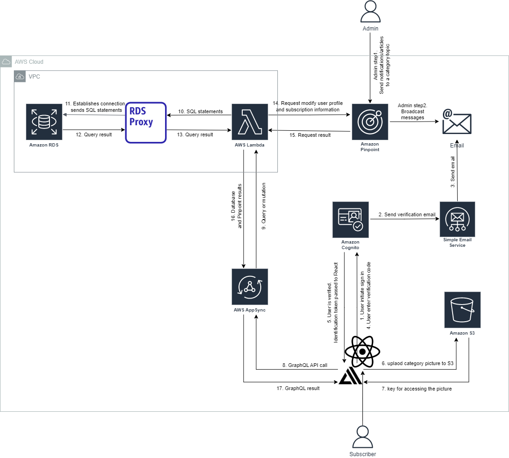

# Backend and Frontend Stack Deep Dive

## Architecture

## Description

### Web portal flow
1. Admin or subscriber user signs in with their email using the web portal.  
2. Cognito sends the user a verification code with AWS SES.
3. SES sends a verification code to user’s email inbox.
4. User enters the code in the web portal.
5. Cognito verifies the user as signed-in.
6. If the admin chooses to upload pictures to categories, Amplify uploads a picture to S3.
7. S3 returns a key and location of the picture.
8. Admin User creates categories and topics in the web portal, which makes a graphQL request to Appsync. Likewise, (Regular) user selects category-topic of interest to subscribe to.
9. Appsync API converts the graphQL query/mutation into SQL statements and passes the SQL statements to a Lambda Function resolver.
10. The Lambda Function sends the SQL statements to an RDS Proxy.
11. The RDS Proxy makes a connection with an AWS MySQL Aurora database and sends the SQL statements to be executed.
12. The database executes the statements and gives back the result.
13. The RDS Proxy forwards the result back to the Lambda Function.
14. If the database operation was successful, the Lambda Function makes a request to Pinpoint to store or modify the user’s profile information as well as subscription status.
15. Pinpoint gives back a result of the operation.
16. The Lambda Function sends the results from the database and Pinpoint back to AppSync.
17. Appsync returns the GraphQL result to React for display in the web portal.

### Pinpoint portal flow
1. An admin user logs in to the AWS Pinpoint portal and defines a user segment by user attributes (like province and category-topics that user is subscribed to) and sends a Pinpoint campaign to the user segment.
2. Pinpoint broadcasts messages to all users that satisfy the criteria for the user group.

