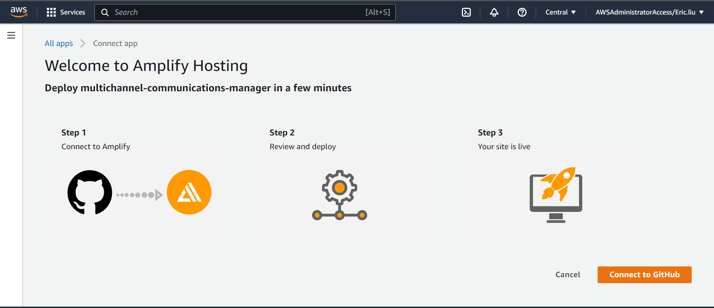
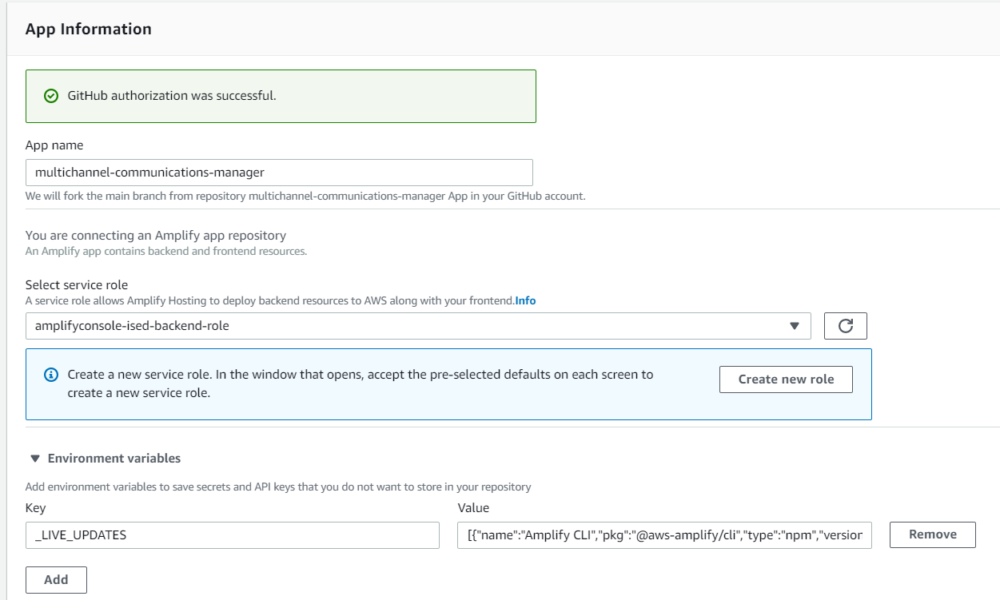

# Intro

The Multichannel Communications Manager solution can be deployed onto your AWS account through this guide. Using AWS Amplify and CloudFormation, we can create all the necessary resources in your own accounts in order to have the solution built in the cloud. This whole process should take around 45-60 minutes, with most of the time spent waiting for resources to provision and build in your account.

# Requirements

Before you deploy, you must have the following accounts created:

- [AWS Account](https://aws.amazon.com/account/)
- [GitHub Account](https://github.com/)

You will also need the following installed on your computer:

- [AWS CLI](https://aws.amazon.com/cli/)
- [AWS SAM](https://docs.aws.amazon.com/serverless-application-model/latest/developerguide/serverless-sam-cli-install.html)
- [AWS CDK](https://docs.aws.amazon.com/cdk/latest/guide/cli.html)

# Step 1: Clone The Repository

First, clone the GitHub repository onto your machine. To do this:

1. Create a folder on your computer to contain the project code.
2. For an Apple computer, open Terminal. If on a Windows machine, open Command Prompt or Windows Terminal. Enter into the folder you made using the command `cd path/to/folder`. To find the path to a folder on a Mac, right click on the folder and press `Get Info`, then select the whole text found under `Where:` and copy with ⌘C. On Windows (not WSL), enter into the folder on File Explorer and click on the path box (located to the left of the search bar), then copy the whole text that shows up.
3. Clone the github repository by entering the following:

```bash
git clone https://github.com/UBC-CIC/multichannel-communications-manager.git
```

The code should now be in the folder you created. Navigate into the frontend folder containing the Amplify project by running the command:

```bash
cd multichannel-communications-manager
```

# Step 2: Frontend Deployment

Before installing Amplify we need to create the IAM Role that gives us the permissions needed to implement this solution. Run the following line of code:

```bash
aws cloudformation deploy --template-file cfn-amplifyRole.yaml --stack-name amplifyconsole-ised-backend-role --capabilities CAPABILITY_NAMED_IAM
```

If you have multiple AWS Profiles, specify one with sufficient admin permissions by appending the following text to the end of the command, replacing the profile name with the profile you would like to use for the solution (If you do this, be sure to include the same `--profile` argument for the rest of the commands starting with `aws`. The profile you are using for this project should have administrator privliges).

```bash
--profile [PROFILE NAME]
```

This step creates the IAM role called **amplifyconsole-ised-backend-role** that will be used on the next step.

The **Deploy to Amplify Console** button will take you to your AWS console to deploy the front-end solution.

<a href="https://console.aws.amazon.com/amplify/home#/deploy?repo=https://github.com/UBC-CIC/multichannel-communications-manager">
    
</a>

1. On the AWS console. select your region on the top right, then connect to GitHub.
2. Select the **amplifyconsole-ised-backend-role** we made previously for the deployment role, and then press the orange button at the bottom of the page, and then press `Continue` when that pops up
3. The deployment will take a few minutes. Wait until the status shows **Verify** in green
4. Click on left taskbar to open menu, click on Rewrites and redirects, and click on edit. Click and replace the first rule's source address (or add a rule if there is none) to `</^((?!\.(css|gif|ico|jpg|js|png|txt|svg|woff|ttf)$).)*$/>`, click and replace target address to `/index.html`, and select and replace **type** with `200 (Rewrite)`, then save. Add a second rule, with the source address as `</^((?!\.(css|gif|ico|jpg|js|png|txt|svg|woff|ttf)$).)*$/>`, the target address as `/index.html`, and the **type** with `404 (Rewrite)`.
   Refer to [AWS's Page on Single Page Apps](https://docs.aws.amazon.com/amplify/latest/userguide/redirects.html#redirects-for-single-page-web-apps-spa) for further information on why we did that
   

The frontend is almost finished being set up, but first we need to deploy our backend. 

# Step 3: Backend Deployment

It's time to set up everything that goes on behind the scenes! For more information on how the backend works, feel free to refer to the Architecture Deep Dive, but an understanding of the backend is not necessary for deployment.

The first step is to get into the backend folder. This can be done with the following command:

```bash
cd sam
```

From here, we are going to run the CloudFormation template. This template will automatically provision the backend resources in your AWS account.

```bash
sam build
```
```bash
sam deploy --guided --capabilities CAPABILITY_NAMED_IAM --stack-name <stack-name-of-your-choosing>
```

NOTE: Be sure to include the `--profile <AWS PROFILE>` to the end of the command if you used it in the previous step!

After running this, you will be prompted with a series of settings to fill in. When there is text in `[square brackets]`, that means whatever is inside is the default value. If you are satisfied with that value for the input, you can just press enter.

If at any point you make a typo, you can press CTRL+C to cancel the process, and then you can re-run the command

The following block of text is what will appear when running the command. It is a series of inputs to enter into the template, which will go line by line. Any text in `[square brackets]` is part of what will appear on screen, and these are the default values. If you are satisfied with that value for the input, you can just press enter. If there is no text in the brackets, that means it is required you enter something yourself as the input. Text in `<angled brackets>` has been added by me to help explain what to input. If there are no angled brackets, that means it is recommended just to use the default value provided, however they can be modified if wanted. Any text in `(rounded brackets)` will appear below a certain input. This will tell any important information to know about the input that is above. Spacing has been added for clarity.

```
   Looking for config file [samconfig.toml] :  Not found
      (this will appear on first invokation, this file can be added to later to save the inputs we used so we do not have to re-enter them on subsequent deployments)

   Setting default arguments for 'sam deploy'
   =========================================
   Stack Name [isedDev]:
   AWS Region [ca-central-1]: <REGION YOU WANT TO DEPLOY TO>
      (Ensure that you enter the same exact region you used to deploy Amplify in)
   Parameter ProjectName []: 
      (This can be anything you want)
   Parameter EnvironmentName [dev]: 
      (This is just to differentiate between different builds, e.x. you can have dev, prod, and test environemnts)
   Parameter LinkToHostingDomain []: 
      (Enter the hosting link that Amplify generated in the previous step)
   Parameter DBName [sys]: 
      (Name of the database, sys is the standard name, must begin with a letter and contain only alphanumeric characters, and be 16 characters or less)
   Parameter DBUser [admin]: 
      (Name of the username to log into the database with, must begin with a letter and contain only alphanumeric characters, and be 16 characters or less)
   <!-- Parameter DBPassword []: <YOUR DB PASSWORD>
      (Password to use for the database, must contain only alphanumeric characters, and be between 8-40 characters) -->
   Parameter DBInstanceClass [db.t2.small]: 
      (What size of database to use. This value can be changed later in RDS settings, however there will be some downtime associated with it. For more information visit https://docs.aws.amazon.com/AmazonRDS/latest/AuroraUserGuide/Concepts.DBInstanceClass.html. The allowed values are db.t2.small, db.t2.medium, db.t3.small, db.t3.medium, db.t3.large, db.t4g.medium, db.t4g.large, db.r4.large, db.r4.xlarge, db.r4.2xlarge, db.r4.4xlarge, db.r4.8xlarge, db.r4.16xlarge, db.r5.large, db.r5.xlarge, db.r5.2xlarge, db.r5.4xlarge, db.r5.8xlarge, db.r5.12xlarge, db.r5.16xlarge, db.r6g.large, db.r6g.xlarge, db.r6g.2xlarge, db.r6g.4xlarge, db.r6g.8xlarge, db.r6g.12xlarge, db.r6g.16xlarge)
   Parameter DBEngineVersion [5.7.mysql_aurora.2.09.2]: 
      (What version of MySQL Aurora to use, the default value is recommended, but any of the following allowed values should work: 5.7.mysql_aurora.2.07.0, 5.7.mysql_aurora.2.07.1, 5.7.mysql_aurora.2.07.1, 5.7.mysql_aurora.2.07.2, 5.7.mysql_aurora.2.07.3, 5.7.mysql_aurora.2.07.4, 5.7.mysql_aurora.2.07.5, 5.7.mysql_aurora.2.07.6, 5.7.mysql_aurora.2.07.7, 5.7.mysql_aurora.2.08.0, 5.7.mysql_aurora.2.08.1, 5.7.mysql_aurora.2.08.2, 5.7.mysql_aurora.2.08.3, 5.7.mysql_aurora.2.08.4, 5.7.mysql_aurora.2.09.0, 5.7.mysql_aurora.2.09.1, 5.7.mysql_aurora.2.09.2, 5.7.mysql_aurora.2.09.3, 5.7.mysql_aurora.2.10.0, 5.7.mysql_aurora.2.10.1, 5.7.mysql_aurora.2.10.2)
   Parameter DeletionProtection [True]: 
      (When deletion proteciton is enabled, when you request the deletion of a database instance in the AWS Console you are blocked and may not continue without first modifying the instance and disabling deletion protection (recommended for production))
   Parameter EncryptDatabase [True]: 
      (Encrypts the database for added security)
   Parameter CognitoAdminName []: <NAME TO USE FOR ADMIN ACCOUNT>
      (For the first administrator user, whatever name you want associated to the account, can be your full name, or any other name you want)
   Parameter CognitoAdminEmail []: <EMAIL TO USE FOR ADMIN ACCOUNT>
      (For the first administrator user, what ever email you want associated to the account. This will be used for login, and you will receive a temporary passowrd to this email for your first login)
   Parameter PinpointAdminEmail []: <EMAIL TO USE FOR ADMIN ACCOUNT>
      (This will be the sender email address of the emails sent from Pinpoint)

   #Shows you resources changes to be deployed and require a 'Y' to initiate deploy
   Confirm changes before deploy [y/N]: y
      (This is good to turn on just to ensure everything is ready to be deployed)
   #SAM needs permission to be able to create roles to connect to the resources in your template
   Allow SAM CLI IAM role creation [Y/n]:
      (Here you can just press enter, the capital Y means that just pressing enter counts as a yes)
   #Preserves the state of previously provisioned resources when an operation fails
   Disable rollback [y/N]:
      (Here you can just press enter, the capital N means that just pressing enter counts as a no)
   Save arguments to configuration file [Y/n]:
      (This will allow any future deployments of this stack to use the inputs you just entered, saving some time)
   SAM configuration file [samconfig.toml]:
      (This file will be made for you, just press enter)
   SAM configuration environment [default]:
      (You can have multiple different environments, each having different saved inputs, but for now just press enter since we do not need to worry about that for this deployment)
```

Be sure to not close the window after this process has completed, as the Outputs section produced will be important for the next step.

# Step 4: Wrap up Frontend Deployment

We need to add a few more things to our Amplify project before we are all done with deploying.

<!-- ## Cognito
1. At the [AWS online console](https://console.aws.amazon.com/console/home), enter `Cognito` in the search bar
2. Select `Manage User Pools`, then select the user pool corresponding to the project name
3. On the left side menu, click on `Attributes` and scroll to the bottom of the page. Enter the following custom attributes and save the changes:
   
4. On the left side menu, click on `MFA and verifications` and scroll down to `Which attributes do you want to verify?`. Select **Email or phone number**. -->

## SES

Amazon SES is what is used to send the verification emails for when users sign in to the application. Your account will be in a sandbox environment by default. While in this mode there will be sending limits and you are only able to send to verified emails. You can request to be moved out of the sandbox to remove these restrictions. In this step we will be configuring the email that will send the verification code to users that sign in. If you do not move out of the sandbox environment then you will also need to verify the emails of all the users that will use the application.

1. At the [AWS online console](https://console.aws.amazon.com/console/home), enter `SES` in the search bar.
2. On the left side menu, click on `Verified identities` and select `Create identity`. Enter the email address and click `Create Identity`
3. A link will be sent to the email. Click on it to confirm and verify that you are authorized to use the email address. This will be used in a later step.
## SNS

Amazon SNS is what is used to send the verification texts when a user first adds their phone number. Your account will be in a sandbox environment by default. While in this mode you can only deliver SMS messages to verified phone numbers. You can request to be moved out of the sandbox to remove the restrictions. If you do not move out of the sandbox environment then you will need to verify the phone numbers of all the users that add it. **This guide assumes your AWS account is in the sandbox environment.**

1. At the [AWS online console](https://console.aws.amazon.com/console/home), enter `SNS` in the search bar. On the left side menu, click on `Text messaging (SMS)` and scroll down to `Sandbox destination phone numbers`
2. Click `Add phone number` and enter your phone number. A verification code will be sent to you which you must enter to verify the number.
## Lambda
1. At the [AWS online console](https://console.aws.amazon.com/console/home), enter `Lambda` in the search bar. On the left side menu click on `Functions`
2. Search for `CreateAuthChallenge` and select the one that was created for the newly deployed project (e.g. isedf0082716f0082716CreateAuthChallenge-devp)
3. Scroll down the page and select `Configuration`. On the left side menu select `Environment Variables`
4. Click on `Edit`. Add the key **SES_FROM_ADDRESS** and give it the value of the email you verified in Amazon SES

Congratulations, your web app is now deployed! You can find the website URL on the main screen of Amplify under `Hosting environments`, and then clicking on the web-browser-esque image under `main`.

<!-- # Step 6: Log into Admin Account

To use the account created with CloudFormation, first navigate to the link of the app. This can be found on the Amplify page, under `Hosting environments`. Clicking on the image below `main` will take you to the website. Then, just log in to the account using the email you provided in the template. For the password, a temporary one will have been sent to your inbox. After logging in, you will be instructed to choose a brand new password. -->

# Step 7 (Optional): Set up other Admin Accounts

To set up other accounts as an admin, you will need to do the following steps. (Note: this assumes the user has already been registered on the app)

1. At the [AWS online console](https://console.aws.amazon.com/console/home), enter `Cognito` in the search bar \
   
2. Select `Manage User Pools` and select the user pool corresponding to the project name
3. Click the `Users and Groups` tab on the menu on the left of the screen, then select the user which you want to set to Admin \
   
4. At the top of the page click `Add to group` and select `Admins` from the dropdown menu \
   
