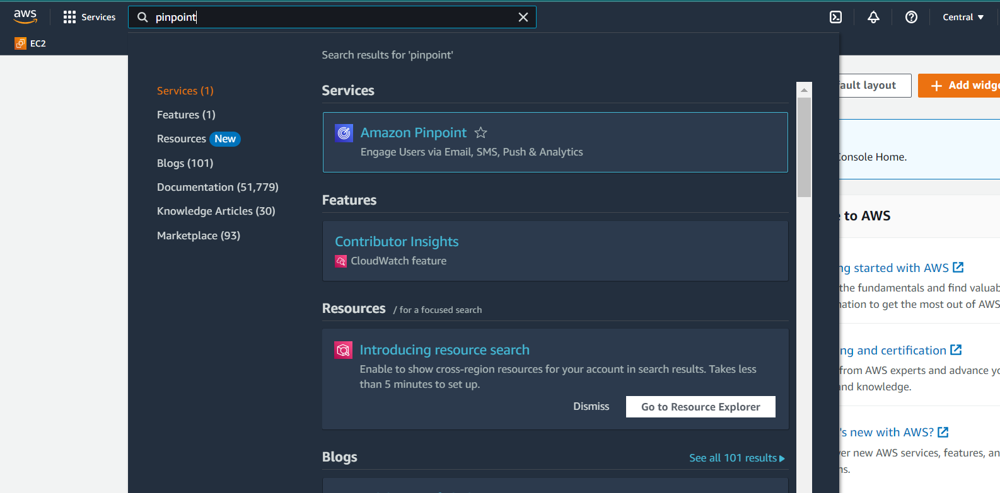

In this guide, you will learn how to send notifications to users who are subscribed to certain topics under certain category. In this example, we email an article "Covid's Impact on BC hospitals" to BC users that are subscribed to either topic COVID-19 or topic Hospitals under the category of Healthcare. 

1. At the [AWS online console](https://console.aws.amazon.com/console/home), enter `Pinpoint` in the search bar
2. Double-click PinpointApp.
3. We are now at the Pinpoint dashboard. We begin by adding the email content to Pinpoint. On the left menu, go to Message templates. A message template in Pinpoint is mesage content that you can reuse when you send messages. [alt text](message_templates.PNG)
4. Click Create template. [alt text](message_template_1.PNG)
5. For Channel, choose Email. Fill in the rest of the details and edit your email body under "Email details". After you are done, click "Create".
6. Next, we configure the details for sending the email. For this we use the Campaigns feature, which can be found at the left menu. Click "Campaigns" and then "Create a campaign". Creating a campaign in Pinpoint initiates a message-sending schedule that targets a specific user group. This sentence will make more sense after you complete the steps to create a campaign.
7. Fill in the details as the following. For Channel, choose Email. Click Next.
8. Select "Create a segment". A segment in Pinpoint is a user group with specific attributes values. Scroll down to "Criteria-optional". Click "Add criteria" and configure the filters as below. In the first filter we set the attribute "province" to BC, meaning we only want to include BC users. Click "Add another segment group", then "Add criteria" and configure the filters as below. In the first filter we set the attribute "HC-COVID19" to include EMAIL, meaning we want to target users that are subscribed to the COVID19 topic under HC(short for Healthcare, this is the acronym you entered when creating the category Healthcare in the web app), that is opted in for email communications. Likewise, we set the attribute "HC-Hospitals" to include EMAIL. Then, we connect these two filters using OR, meaning we want to target users that are subscribed to either the COVID19 or Hospital topic.
9. After you've configured the filters, underneath there is a section titled "Segment estimate" where you can see how many users are selected after you specified the filters. Click Next
10. 