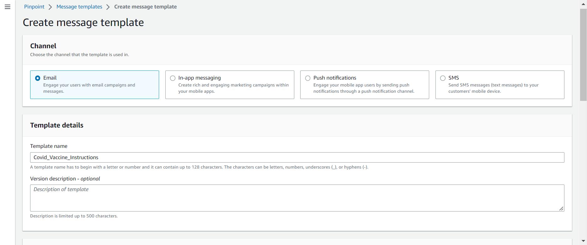
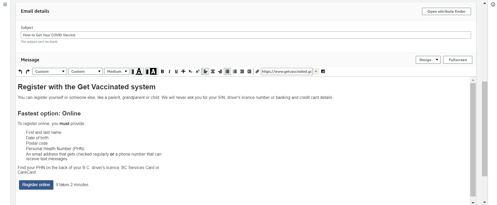
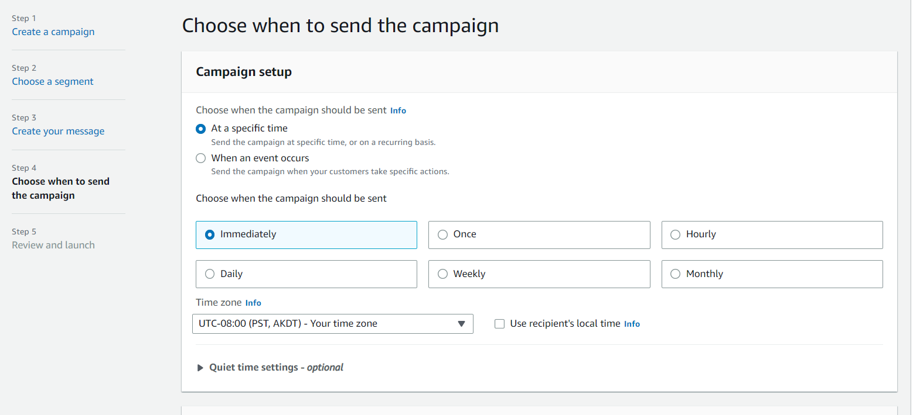

# Pinpoint Guide

**Before Continuing with this User Guide, please make sure you have deployed the frontend and backend stacks.**

- [Deployment Guides](./DeploymentGuide.md)

In this guide, you will learn how to send notifications to users who are subscribed to certain topics under certain category. In this example, we email an article titled "Covid Vaccine Instructions" to all BC users that are subscribed to the topic COVID-19 under the category Healthcare. 

1. At the [AWS online console](https://console.aws.amazon.com/console/home), enter `Pinpoint` in the search bar, and go to "Amazon Pinpoint".
2. Click PinpointApp under "All Projects".
3. We are now at the Pinpoint dashboard. We begin by adding the email content to Pinpoint. On the left menu, go to Message templates. A message template in Pinpoint is mesage content that you can reuse when you send messages. 
4. Click Create template. 
5. For Channel, choose Email. Fill in the rest of the details and edit your email body under "Email details". After you are done, scroll down to the very bottom and click "Create".  
6. Next, we configure the details for sending the email. For this we use the Campaigns feature, which can be found at the left menu. Click "Campaigns" and then "Create a campaign". Creating a campaign in Pinpoint initiates a message-sending schedule that targets a specific user group. This sentence will make more sense after you complete the steps below to create a campaign.
7. Fill in the details as the following. For Channel, choose Email. Click Next. 
8. In the "Choose a segment" step, select "Create a segment". A segment in Pinpoint is a user group with specific attributes values. Scroll down to "Criteria-optional". Click "Add criteria" and configure the filters as below. In the first filter we set the attribute "HC-COVID19" to contains EMAIL, meaning we want to target users that are subscribed to the COVID19 topic under HC (short for Healthcare, this is the acronym you entered when creating the category Healthcare in the web app), that is opted in for email communications. In the second filter we set the attribute "province" to BC, meaning we only want to include BC users. After you've configured the filters, underneath there is a section titled "Segment estimate" where you can see how many users are selected after you specified the filters. Click Next 
9. In the "Create your message" step, select "Choose an existing email template", then set the template you created in step 5. 
10. Leave the rest as is, then click Next.
11. In this page, you can set the schedule by which you want your email to be delivered. Choose according to your needs and click Next. 
12. In this page, you can review the campaign you just created. If nothing is off, scroll to the bottom and click "Launch campaign". 
13. You've now created a campaign and can expect your subscribers to start receiving emails!