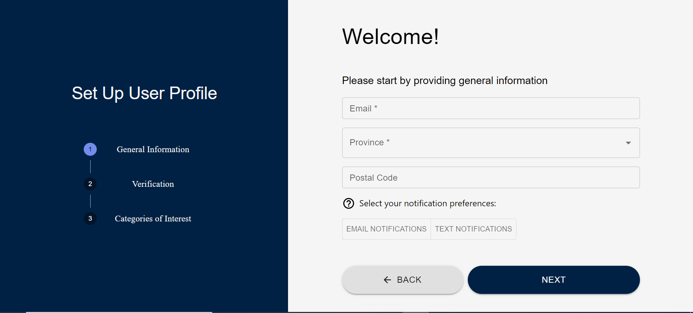
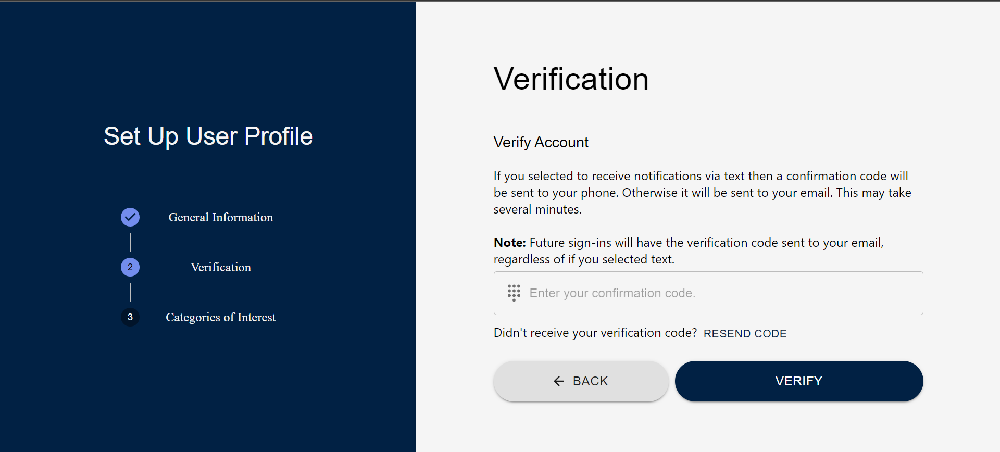
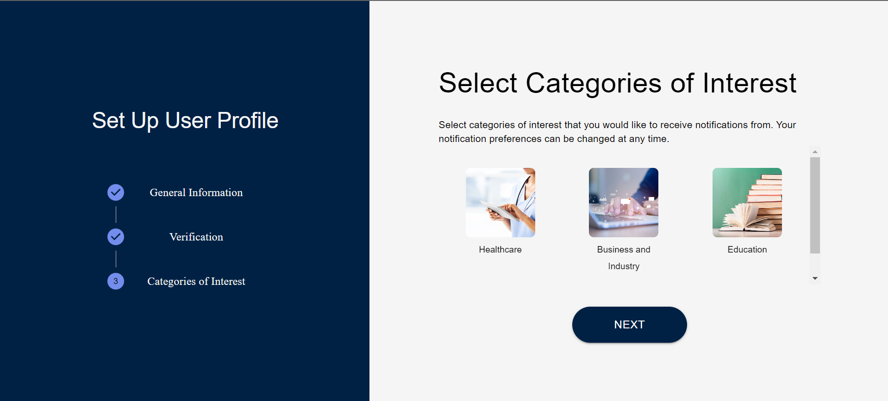
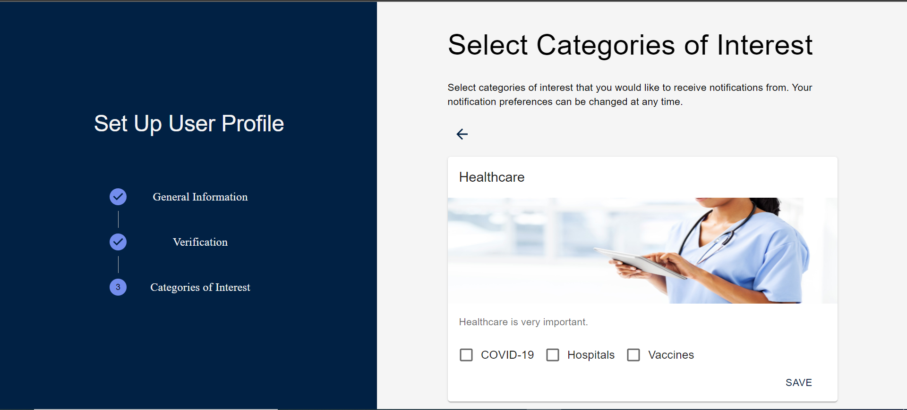
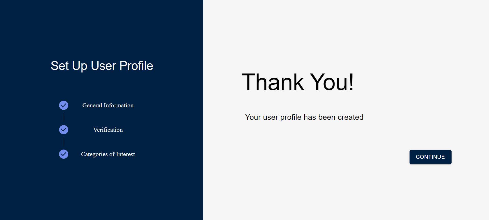
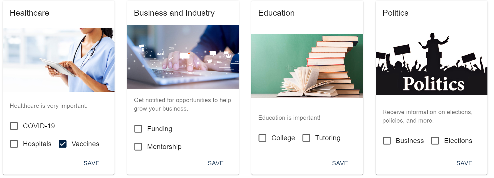
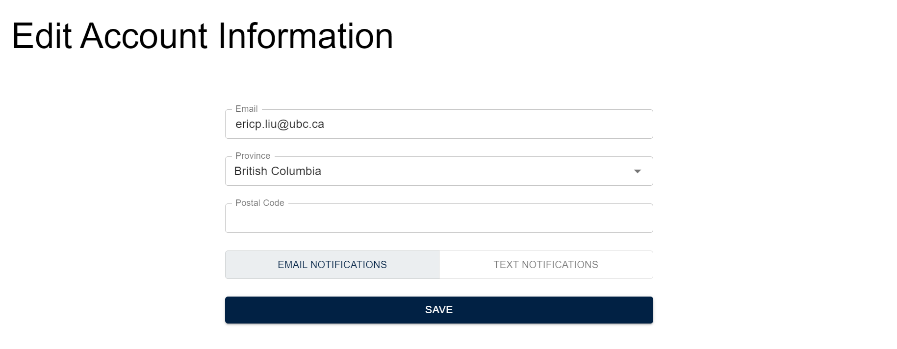
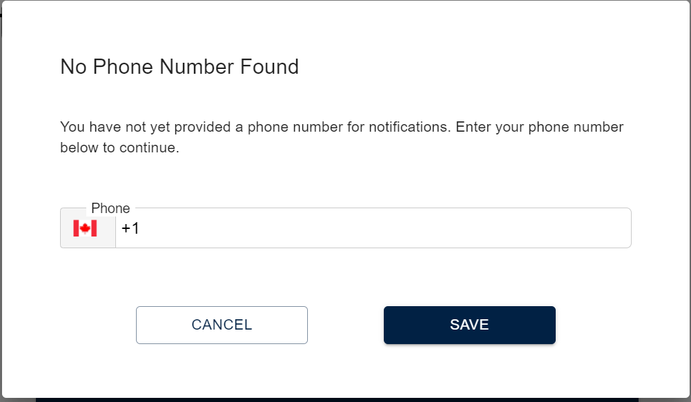

# User Guide

**Before Continuing with this User Guide, please make sure you have deployed the frontend and backend stacks.**

- [Deployment Guides](./DeploymentGuide.md)

| Index                                                               | Description                                                                                        |
| :------------------------------------------------------------------ | :------------------------------------------------------------------------------------------------- |
| [Sign Up](#sign-up)                                       | The sign up process                                                                       |
| [Landing Page](#landing-page)                                       | Change your subscriptions                                                                       |
| [Edit Account](#edit-account)                                           | Edit your account details                                                                        |
| [Admin Dashboard](#admin-dashboard)                                 | Create/Update/Delete topics and categories                                                    |

## Sign Up

1. When you first create an account, several details are required. You will need to enter your email address, province, as well as your notification preferences. Your notification preferences will be how you receive notifications for the topics you subscribe to. If you select text, another field will appear for you to enter your phone number. The postal code field is optional. 
2. After you enter your details and click `Next`, a verification code will be sent to you. If you selected text for your notification preferences, then the code will be sent to your phone number; otherwise, it will be sent to your email. **Note:** The code will only be sent to your phone number for the initial sign up; future sign-ins will send the authentication code to your email, regardless of if you selected text on sign up.  
3. Once you're account has been verified, you will be sent to a screen where you'll be able to subscribe to categories and topics. To view a category's details as well as its topics, click on the icon corresponding to the category of interest. 
4. Clicking on a category will display a card that shows its title, image, and description. The topics associated with the category will also be displayed. To subscribe to a topic, select its checkbox and click `Save`. 
5. Once you have subscribed to all your topics you will be greeted with a profile success screen. Click `Continue` to move on to the application. 
## Landing Page

Once a user is logged in, the Landing Page displays all the currently available categories and topics. It will automatically check off all the topics the user is subscribed to. The user can change their subscriptions here by selecting the topics and hitting `Save` for the category of interest. 

## Edit Account

This page displays the user's details that were entered during sign up. They can be changed by editing the textfields and clicking `Save`. 

If the user wants to change their notification preferences to text, and they didn't select it during sign up, a pop-up will appear for the user to enter their phone number and verify it. 

## Admin Dashboard

- **Users can only access this page if they are admin users**. The Admin Dashboard is used to create new categories and topics, as well as delete/update existing ones.
   

There are 3 main components:
 

### 1. Dashboard

- The Dashboard displays all the categories currently available, as well as a search bar to quickly find categories and the buttons to create/delete categories and topics.

  

- To view more details about a specific category, click on it's box and a card will appear. The card will display the title, image, and description of the selected category.
  
- To edit the category, click on the edit icon on the lower right part of the card. A pop-up will appear for you to change its details.
  
- To view the topics for the category, click on the `View Topics` button. The card will flip and display all the topics associated with it.
  
  To add a topic, simply enter the name for it in the textbox on the upper right of the card and click the plus icon. To remove a topic, select the checkbox associated with it and hit `Delete`. **This will only remove the topic from this category.**

   

### 2. Create Category

- Clicking on the plus icon on the dashboard will cause a pop-up to appear where you'll be able to create a new category and the topics for it.
  
    
 

### 3. Delete Category/Topic

- Clicking on the trash icon on the dashboard will cause a pop-up to appear that will display a list of all the categories and topics that are currently available.
   
  
   
  **Note:** Deleting a category will remove it, including for users that are subscribed to it. Deleting a topic will remove it from all categories that have it.
  