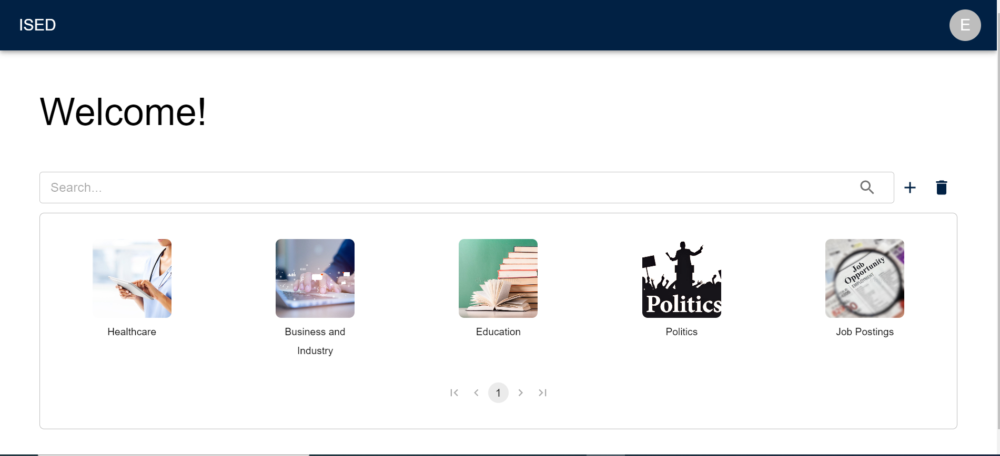

# User Guide

**Before Continuing with this User Guide, please make sure you have deployed the frontend and backend stacks.**

- [Deployment Guides](./DeploymentGuide.md)

| Index                                                               | Description                                                                                        |
| :------------------------------------------------------------------ | :------------------------------------------------------------------------------------------------- |
| [Landing Page](#landing-page)                                       | Change your subscriptions                                                                       |
| [Edit Account](#edit-account)                                           | Edit your account details                                                                        |
| [Admin Dashboard](#admin-dashboard)                                 | Create/Update/Delete topics and categories                                                    |

<!-- ## Landing Page

Once a user is logged in, the Landing Page displays relevant updates including alerts, the user's recent progress, leaderboards and a list of the groups a user belongs to. There are 4 main sections.

### 1. Alerts

- The `New Actions in Need of Validation` alert is displayed when the user is an admin or a group owner and there are actions by their group members that they need to validate
- The `Actions Pending Validation` alert is displayed if the user has any actions pending manual validation. This alert shows the potential impact of the user's pending actions
  

### 2. Recent Progress

- This section displays the collective CO2 impact of all users on the app, and the current user's weekly and cumulative CO2 saved
  

### 3. Leaderboards

- There are 2 leaderboards to toggle between: Global Groups (ranks all groups in the app) and Group Users (ranks all users in the app)
- Users can filter the metric they want to view by clicking the filter button (available metrics are Total CO2, Weekly CO2, Total Points and Weekly Points)
  

### 4. My Groups

- This section displays all the groups that the user belongs to
- Clicking on the group name will redirect to the group's profile page
- Clicking on the dropdown accordion opens up charts displaying the user's individual contribution for each group stat (hover over each colour in the graph to see labels - grey is the contribution of all other members, green is the user's contribution)
- Users can also access the `Create Group` page by clicking the `Create Group` button (More information in [Create New Group](#Create-New-Group))
  

## Edit Account

- The search bar on this page searches through all public groups to return group cards for any groups with a name that matches the user-inputted search term
   -->

## Admin Dashboard

- Users can only access this page if they are admin users. The Admin Dashboard is used to create new categories and topics, as well as delete/update existing ones.
   

There are 3 main components:
 

### 1. Dashboard

- The Dashboard displays all the categories currently available, as well as a search bar to quickly find categories and the buttons to create/delete categories and topics.

  

- To view more details about a specific category, click on it's box and a card will appear. The card will display the title, image, and description of the selected category.
  
- To edit the category, click on the edit icon on the lower right part of the card. A pop-up will appear for you to change its details.
  
- To view the topics for the category, click on the `View Topics` button. The card will flip and display all the topics associated with it.
  
  To add a topic, simply enter the name for it in the textbox on the upper right of the card and click the plus icon. To remove a topic, select the checkbox associated with it and hit `Delete`. **This will only remove the topic from this category.**

   

### 2. Create Category

- Clicking on the plus icon on the dashboard will cause a pop-up to appear where you'll be able to create a new category and the topics for it.
  
    
 

### 3. Delete Category/Topic

- Clicking on the trash icon on the dashboard will cause a pop-up to appear that will display a list of all the categories and topics that are currently available.
   
  
   
  **Note:** Deleting a category will remove it, including for users that are subscribed to it. Deleting a topic will remove it from all categories that have it.
  